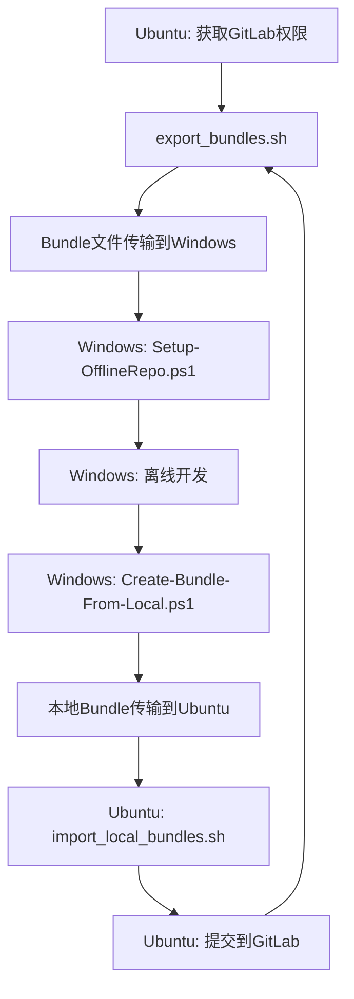
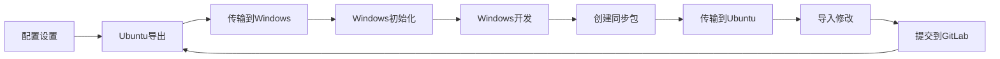

# SLAM 离线仓库管理工具 - 增强版

这套工具用于管理基于 Git Bundle 的离线 SLAM 项目仓库，支持主仓库和任意深度子模块的离线操作，**新增双向同步功能**。

## 🆕 新增功能

### 双向同步支持
- ✅ **Windows → Ubuntu**: `Create-Bundle-From-Local.ps1` 将本地修改打包
- ✅ **Ubuntu → Windows**: `import_local_bundles.sh` 导入Windows修改
- ✅ **自动化工作流**: `Auto-Sync-Workflow.ps1` 一键式同步体验

## 📁 项目结构

```
bundles/
├── _unpacked/                    # 解包后的裸仓库目录
├── *.bundle                      # Git Bundle 文件
├── Setup-OfflineRepo.ps1        # 初始化脚本
├── Update-OfflineRepo.ps1       # 更新脚本
├── Backup-BeforeUpdate.ps1      # 备份脚本
├── Merge-LocalChanges.ps1       # 合并脚本
├── Interactive-Merge.ps1        # 交互式合并脚本
├── Create-Bundle-From-Local.ps1 # 🆕 创建本地bundle
├── Auto-Sync-Workflow.ps1       # 🆕 自动化工作流
├── export_bundles.sh            # Ubuntu导出脚本
├── import_local_bundles.sh      # 🆕 Ubuntu导入脚本
└── README.md                    # 本文档
```

## 🔄 完整工作流程

### 标准开发流程



### 详细操作步骤

#### 1. Ubuntu端 - 导出最新代码
```bash
# 在Ubuntu上导出最新bundle
./export_bundles.sh
# 将bundles目录传输到Windows
```

#### 2. Windows端 - 初始化离线环境
```powershell
# 首次设置
.\Setup-OfflineRepo.ps1

# 日常更新
.\Update-OfflineRepo.ps1
```

#### 3. Windows端 - 离线开发
```powershell
# 进行代码修改
git add .
git commit -m "我的修改"

# 使用自动化工作流（推荐）
.\Auto-Sync-Workflow.ps1 -CreateLocalBundle
```

#### 4. Windows端 - 创建本地bundle
```powershell
# 手动创建本地bundle
.\Create-Bundle-From-Local.ps1 -CreateDiff

# 或使用自动化工作流
.\Auto-Sync-Workflow.ps1 -CreateLocalBundle
```

#### 5. Ubuntu端 - 导入Windows修改
```bash
# 导入Windows的修改
./import_local_bundles.sh local_20250101_120000

# 检查并提交到GitLab
git status
git add .
git commit -m "从Windows同步的修改"
git push
```

## 🛠️ 新增脚本详细说明

### Create-Bundle-From-Local.ps1 - 本地Bundle创建脚本

**用途**：将Windows上的本地修改打包成bundle文件

**功能**：
- ✅ 检查本地修改状态
- ✅ 创建主仓库bundle
- ✅ 创建所有子模块bundle
- ✅ 生成差异报告
- ✅ 创建同步信息文件

**参数**：
```powershell
param (
    [string]$RepoDir = 'D:\Projects\github\slam-core',
    [string]$OutputDir = 'D:\Projects\github\slam-core\local-bundles',
    [switch]$IncludeAll,    # 包含所有分支
    [switch]$CreateDiff     # 创建差异报告
)
```

**使用示例**：
```powershell
# 基本用法
.\Create-Bundle-From-Local.ps1

# 包含所有分支和差异报告
.\Create-Bundle-From-Local.ps1 -IncludeAll -CreateDiff
```

### import_local_bundles.sh - Ubuntu导入脚本

**用途**：在Ubuntu上导入从Windows传来的本地修改

**功能**：
- ✅ 解析bundle信息文件
- ✅ 导入主仓库修改
- ✅ 导入子模块修改
- ✅ 更新同步标签
- ✅ 显示差异报告

**用法**：
```bash
# 导入指定前缀的bundle
./import_local_bundles.sh local_20250101_120000

# 指定自定义目录
./import_local_bundles.sh local_20250101_120000 /path/to/local-bundles
```

### Auto-Sync-Workflow.ps1 - 自动化工作流

**用途**：一键式同步体验，整合所有操作

**功能**：
- ✅ 检查本地状态
- ✅ 自动备份
- ✅ 处理本地修改
- ✅ 更新到最新bundle
- ✅ 可选创建本地bundle

**参数**：
```powershell
param (
    [string]$RepoDir = 'D:\Projects\github\slam-core',
    [string]$BundlesDir = 'D:\Work\code\2025\0625\bundles',
    [switch]$CreateLocalBundle,    # 是否创建本地bundle
    [switch]$AutoResolve,          # 自动解决冲突
    [switch]$SkipBackup           # 跳过备份
)
```

**使用示例**：
```powershell
# 基本同步
.\Auto-Sync-Workflow.ps1

# 同步并创建本地bundle
.\Auto-Sync-Workflow.ps1 -CreateLocalBundle

# 自动解决冲突
.\Auto-Sync-Workflow.ps1 -AutoResolve -CreateLocalBundle
```

## 🎯 使用场景

### 场景1：日常开发
```powershell
# Windows端：一键同步
.\Auto-Sync-Workflow.ps1 -CreateLocalBundle

# 将local-bundles目录传输到Ubuntu
# Ubuntu端：导入修改
./import_local_bundles.sh local_20250101_120000
```

### 场景2：冲突处理
```powershell
# Windows端：交互式处理冲突
.\Interactive-Merge.ps1

# 或自动解决冲突
.\Auto-Sync-Workflow.ps1 -AutoResolve
```

### 场景3：批量更新
```powershell
# Windows端：批量更新多个仓库
$repos = @("repo1", "repo2", "repo3")
foreach ($repo in $repos) {
    .\Auto-Sync-Workflow.ps1 -RepoDir "D:\Projects\$repo"
}
```

## 📊 工具对比

| 功能 | 原有工具 | 新增工具 | 优势 |
|------|----------|----------|------|
| 离线开发 | ✅ | ✅ | 完整支持 |
| 冲突处理 | ✅ | ✅ | 多种策略 |
| 备份保护 | ✅ | ✅ | 自动备份 |
| **双向同步** | ❌ | ✅ | **新增功能** |
| **自动化工作流** | ❌ | ✅ | **一键操作** |
| **差异报告** | ❌ | ✅ | **可视化对比** |

## ⚠️ 注意事项

### 安全建议

1. **总是先备份**：使用 `Auto-Sync-Workflow.ps1` 自动备份
2. **检查差异**：使用 `-CreateDiff` 参数查看修改内容
3. **测试验证**：导入后运行测试确保代码质量
4. **版本管理**：使用有意义的commit消息

### 最佳实践

1. **定期同步**：建议每天同步一次
2. **小批量修改**：避免大量修改一次性同步
3. **及时提交**：重要修改及时创建bundle
4. **备份重要**：重要修改前创建备份

## 🚀 快速开始

### 首次使用

1. **Ubuntu端**：
   ```bash
   ./export_bundles.sh
   # 传输bundles目录到Windows
   ```

2. **Windows端**：
   ```powershell
   .\Setup-OfflineRepo.ps1
   .\Auto-Sync-Workflow.ps1 -CreateLocalBundle
   ```

3. **Ubuntu端**：
   ```bash
   ./import_local_bundles.sh local_20250101_120000
   ```

### 日常使用

```powershell
# Windows端：一键同步
.\Auto-Sync-Workflow.ps1 -CreateLocalBundle

# 传输local-bundles到Ubuntu
# Ubuntu端：导入修改
./import_local_bundles.sh local_20250101_120000
```

## 📞 技术支持

如果遇到问题，请检查：

1. **路径配置**：确保所有路径正确
2. **权限问题**：确保有足够的文件系统权限
3. **Git状态**：确保Git仓库状态正常
4. **Bundle完整性**：确保bundle文件完整

---

**注意**：这套工具现在支持完整的双向同步，可以满足复杂的离线开发需求。

# Git 离线开发工具 - 增强版操作指南

这套工具让您可以在Windows上离线开发Git仓库，然后同步回Ubuntu服务器。**现在支持灵活的配置管理！**

## 🎯 使用场景

- **Windows电脑**：无法访问GitLab，需要离线开发
- **Ubuntu服务器**：有GitLab权限，可以导出和提交代码
- **目标**：两台电脑之间安全地同步代码修改

## 🆕 新功能：配置管理系统

### 配置文件支持
- 统一的 `config.json` 配置文件
- 支持Windows和Ubuntu不同平台的路径配置
- 环境变量覆盖支持
- 自动检测操作系统平台

### 环境变量支持
- `GIT_OFFLINE_REPO_DIR`: 仓库目录
- `GIT_OFFLINE_BUNDLES_DIR`: bundles目录
- `GIT_OFFLINE_LOCAL_BUNDLES_DIR`: 本地bundles目录
- `GIT_OFFLINE_BACKUP_DIR`: 备份目录
- `GIT_OFFLINE_USER_NAME`: Git用户名
- `GIT_OFFLINE_USER_EMAIL`: Git邮箱

## 📋 快速开始

### 第一步：配置设置

#### 方法1：使用配置文件（推荐）
1. 复制配置示例文件：
```bash
cp config.example.json config.json
```

2. 编辑 `config.json` 文件，设置您的路径：
```json
{
  "paths": {
    "windows": {
      "repo_dir": "D:/Projects/github/slam-core",
      "bundles_dir": "D:/Work/code/2025/0625/bundles",
      "local_bundles_dir": "D:/Projects/github/slam-core/local-bundles"
    },
    "ubuntu": {
      "repo_dir": "/work/develop_gitlab/slam-core",
      "bundles_dir": "/work/develop_gitlab/slam-core/bundles",
      "local_bundles_dir": "./local-bundles"
    }
  }
}
```

#### 方法2：使用环境变量
在Windows上设置环境变量：
```powershell
.\Set-Environment.ps1
```

在Ubuntu上设置环境变量：
```bash
export GIT_OFFLINE_UBUNTU_REPO_DIR="/your/repo/path"
export GIT_OFFLINE_UBUNTU_BUNDLES_DIR="/your/bundles/path"
```

### 第二步：检查配置
```powershell
# Windows
.\Show-Config.ps1

# Ubuntu
./export_bundles.sh  # 会显示使用的配置
```

### 第三步：Ubuntu导出最新代码

在Ubuntu服务器上运行：
```bash
./export_bundles.sh
```

这会创建一个`bundles`目录，包含所有代码的离线包。

### 第四步：传输到Windows

将`bundles`目录复制到Windows电脑上。

### 第五步：Windows初始化

在Windows上首次使用时：
```powershell
.\Setup-OfflineRepo.ps1
```

这会创建离线工作环境。

### 第六步：Windows离线开发

正常进行代码修改：
```powershell
# 修改代码
git add .
git commit -m "我的修改"
```

### 第七步：创建同步包

开发完成后，创建同步包：
```powershell
.\Create-Bundle-From-Local.ps1
```

这会在配置的`local_bundles_dir`目录生成同步文件。

### 第八步：传输回Ubuntu

将本地bundles目录复制回Ubuntu服务器。

### 第九步：Ubuntu导入修改

在Ubuntu上导入Windows的修改：
```bash
./import_local_bundles.sh local_20250101_120000
```

### 第十步：提交到GitLab

检查并提交修改：
```bash
git status
git add .
git commit -m "从Windows同步的修改"
git push
```

## 🚀 一键式操作（推荐）

### Windows端：一键同步
```powershell
.\Auto-Sync-Workflow.ps1 -CreateLocalBundle
```

这个命令会：
1. 检查本地修改
2. 自动备份
3. 更新到最新代码
4. 创建同步包

### Ubuntu端：导入修改
```bash
./import_local_bundles.sh local_20250101_120000
```

## 📁 文件说明

| 文件 | 用途 | 使用场景 |
|------|------|----------|
| `config.json` | 主配置文件 | 设置所有路径和选项 |
| `config.example.json` | 配置示例文件 | 参考配置格式 |
| `Config-Manager.psm1` | 配置管理模块 | PowerShell配置处理 |
| `Show-Config.ps1` | 配置检查脚本 | 检查配置状态 |
| `Set-Environment.ps1` | 环境变量设置 | 设置环境变量 |
| `export_bundles.sh` | Ubuntu导出代码 | 每次需要更新代码时 |
| `Setup-OfflineRepo.ps1` | Windows初始化 | 首次使用或重新设置 |
| `Auto-Sync-Workflow.ps1` | Windows一键同步 | 日常开发使用 |
| `Create-Bundle-From-Local.ps1` | 创建同步包 | 需要同步修改时 |
| `import_local_bundles.sh` | Ubuntu导入修改 | 接收Windows修改时 |

## ⚙️ 配置选项详解

### 路径配置
```json
{
  "paths": {
    "windows": {
      "repo_dir": "仓库目录路径",
      "bundles_dir": "bundles文件目录",
      "local_bundles_dir": "本地bundles输出目录",
      "backup_dir": "备份目录"
    },
    "ubuntu": {
      "repo_dir": "Ubuntu仓库目录",
      "bundles_dir": "Ubuntu bundles目录",
      "local_bundles_dir": "Ubuntu本地bundles目录"
    }
  }
}
```

### Git配置
```json
{
  "git": {
    "user_name": "Git用户名",
    "user_email": "Git邮箱",
    "allow_protocol": "允许的Git协议"
  }
}
```

### 同步配置
```json
{
  "sync": {
    "backup_before_update": true,
    "create_diff_report": true,
    "auto_resolve_conflicts": false
  }
}
```

### Bundle配置
```json
{
  "bundle": {
    "include_all_branches": false,
    "timestamp_format": "yyyyMMdd_HHmmss",
    "local_prefix": "local_"
  }
}
```

## 🔧 高级用法

### 参数覆盖
所有脚本都支持参数覆盖配置文件：
```powershell
# 使用自定义路径
.\Setup-OfflineRepo.ps1 -RepoDir "D:/MyRepo" -BundlesDir "D:/MyBundles"

# 使用自定义配置文件
.\Setup-OfflineRepo.ps1 -ConfigFile "my-config.json"
```

### 环境变量优先级
1. 脚本参数（最高优先级）
2. 环境变量
3. 配置文件
4. 默认值（最低优先级）

### 配置检查
```powershell
# 检查配置状态
.\Show-Config.ps1

# 检查环境变量
.\Set-Environment.ps1 -ShowCurrent

# 清除环境变量
.\Set-Environment.ps1 -ClearAll
```

## ⚠️ 注意事项

### 安全提醒
- 重要修改前建议先备份
- 定期同步，避免积累太多修改
- 导入后要测试代码是否正常

### 配置建议
- 使用绝对路径避免路径解析问题
- 确保所有目录都有写入权限
- 定期备份配置文件

### 常见问题
**Q: 配置读取失败怎么办？**
A: 运行 `.\Show-Config.ps1` 检查配置状态

**Q: 如何在不同项目间切换？**
A: 使用不同的配置文件或环境变量

**Q: 同步时提示有冲突怎么办？**
A: 使用 `.\Interactive-Merge.ps1` 手动解决冲突

**Q: 忘记bundle前缀怎么办？**
A: 查看本地bundles目录中的文件名，前缀是配置的`local_prefix`开头的

**Q: 如何回滚到之前的版本？**
A: 使用备份目录或 `git reset --hard <commit-hash>`

## 🔄 完整工作流程示例



## 📞 需要帮助？

如果遇到问题：
1. 运行 `.\Show-Config.ps1` 检查配置
2. 检查文件路径是否正确
3. 确保有足够的磁盘空间
4. 确认Git仓库状态正常
5. 查看错误信息中的具体提示

---

**提示**：建议先在小项目上测试这套工具，熟悉后再用于重要项目。 