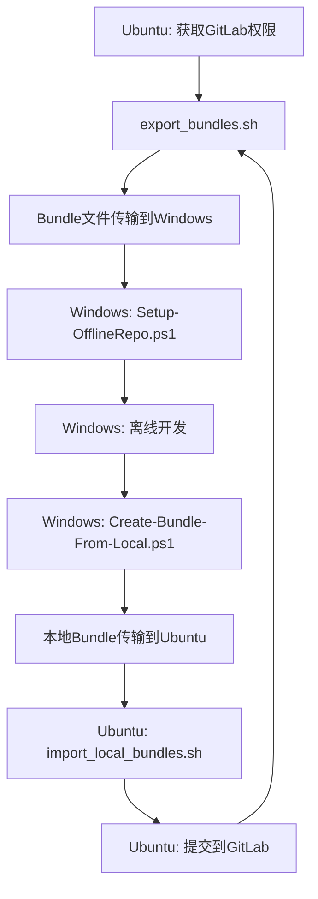

# SLAM 离线仓库管理工具 - 增强版

这套工具用于管理基于 Git Bundle 的离线 SLAM 项目仓库，支持主仓库和任意深度子模块的离线操作，**新增双向同步功能**。

## 🆕 新增功能

### 双向同步支持
- ✅ **Windows → Ubuntu**: `Create-Bundle-From-Local.ps1` 将本地修改打包
- ✅ **Ubuntu → Windows**: `import_local_bundles.sh` 导入Windows修改
- ✅ **自动化工作流**: `Auto-Sync-Workflow.ps1` 一键式同步体验

## 📁 项目结构

```
bundles/
├── _unpacked/                    # 解包后的裸仓库目录
├── *.bundle                      # Git Bundle 文件
├── Setup-OfflineRepo.ps1        # 初始化脚本
├── Update-OfflineRepo.ps1       # 更新脚本
├── Backup-BeforeUpdate.ps1      # 备份脚本
├── Merge-LocalChanges.ps1       # 合并脚本
├── Interactive-Merge.ps1        # 交互式合并脚本
├── Create-Bundle-From-Local.ps1 # 🆕 创建本地bundle
├── Auto-Sync-Workflow.ps1       # 🆕 自动化工作流
├── export_bundles.sh            # Ubuntu导出脚本
├── import_local_bundles.sh      # 🆕 Ubuntu导入脚本
└── README.md                    # 本文档
```

## 🔄 完整工作流程

### 标准开发流程



### 详细操作步骤

#### 1. Ubuntu端 - 导出最新代码
```bash
# 在Ubuntu上导出最新bundle
./export_bundles.sh
# 将bundles目录传输到Windows
```

#### 2. Windows端 - 初始化离线环境
```powershell
# 首次设置
.\Setup-OfflineRepo.ps1

# 日常更新
.\Update-OfflineRepo.ps1
```

#### 3. Windows端 - 离线开发
```powershell
# 进行代码修改
git add .
git commit -m "我的修改"

# 使用自动化工作流（推荐）
.\Auto-Sync-Workflow.ps1 -CreateLocalBundle
```

#### 4. Windows端 - 创建本地bundle
```powershell
# 手动创建本地bundle
.\Create-Bundle-From-Local.ps1 -CreateDiff

# 或使用自动化工作流
.\Auto-Sync-Workflow.ps1 -CreateLocalBundle
```

#### 5. Ubuntu端 - 导入Windows修改
```bash
# 导入Windows的修改
./import_local_bundles.sh local_20250101_120000

# 检查并提交到GitLab
git status
git add .
git commit -m "从Windows同步的修改"
git push
```

## 🛠️ 新增脚本详细说明

### Create-Bundle-From-Local.ps1 - 本地Bundle创建脚本

**用途**：将Windows上的本地修改打包成bundle文件

**功能**：
- ✅ 检查本地修改状态
- ✅ 创建主仓库bundle
- ✅ 创建所有子模块bundle
- ✅ 生成差异报告
- ✅ 创建同步信息文件

**参数**：
```powershell
param (
    [string]$RepoDir = 'D:\Projects\github\slam-core',
    [string]$OutputDir = 'D:\Projects\github\slam-core\local-bundles',
    [switch]$IncludeAll,    # 包含所有分支
    [switch]$CreateDiff     # 创建差异报告
)
```

**使用示例**：
```powershell
# 基本用法
.\Create-Bundle-From-Local.ps1

# 包含所有分支和差异报告
.\Create-Bundle-From-Local.ps1 -IncludeAll -CreateDiff
```

### import_local_bundles.sh - Ubuntu导入脚本

**用途**：在Ubuntu上导入从Windows传来的本地修改

**功能**：
- ✅ 解析bundle信息文件
- ✅ 导入主仓库修改
- ✅ 导入子模块修改
- ✅ 更新同步标签
- ✅ 显示差异报告

**用法**：
```bash
# 导入指定前缀的bundle
./import_local_bundles.sh local_20250101_120000

# 指定自定义目录
./import_local_bundles.sh local_20250101_120000 /path/to/local-bundles
```

### Auto-Sync-Workflow.ps1 - 自动化工作流

**用途**：一键式同步体验，整合所有操作

**功能**：
- ✅ 检查本地状态
- ✅ 自动备份
- ✅ 处理本地修改
- ✅ 更新到最新bundle
- ✅ 可选创建本地bundle

**参数**：
```powershell
param (
    [string]$RepoDir = 'D:\Projects\github\slam-core',
    [string]$BundlesDir = 'D:\Work\code\2025\0625\bundles',
    [switch]$CreateLocalBundle,    # 是否创建本地bundle
    [switch]$AutoResolve,          # 自动解决冲突
    [switch]$SkipBackup           # 跳过备份
)
```

**使用示例**：
```powershell
# 基本同步
.\Auto-Sync-Workflow.ps1

# 同步并创建本地bundle
.\Auto-Sync-Workflow.ps1 -CreateLocalBundle

# 自动解决冲突
.\Auto-Sync-Workflow.ps1 -AutoResolve -CreateLocalBundle
```

## 🎯 使用场景

### 场景1：日常开发
```powershell
# Windows端：一键同步
.\Auto-Sync-Workflow.ps1 -CreateLocalBundle

# 将local-bundles目录传输到Ubuntu
# Ubuntu端：导入修改
./import_local_bundles.sh local_20250101_120000
```

### 场景2：冲突处理
```powershell
# Windows端：交互式处理冲突
.\Interactive-Merge.ps1

# 或自动解决冲突
.\Auto-Sync-Workflow.ps1 -AutoResolve
```

### 场景3：批量更新
```powershell
# Windows端：批量更新多个仓库
$repos = @("repo1", "repo2", "repo3")
foreach ($repo in $repos) {
    .\Auto-Sync-Workflow.ps1 -RepoDir "D:\Projects\$repo"
}
```

## 📊 工具对比

| 功能 | 原有工具 | 新增工具 | 优势 |
|------|----------|----------|------|
| 离线开发 | ✅ | ✅ | 完整支持 |
| 冲突处理 | ✅ | ✅ | 多种策略 |
| 备份保护 | ✅ | ✅ | 自动备份 |
| **双向同步** | ❌ | ✅ | **新增功能** |
| **自动化工作流** | ❌ | ✅ | **一键操作** |
| **差异报告** | ❌ | ✅ | **可视化对比** |

## ⚠️ 注意事项

### 安全建议

1. **总是先备份**：使用 `Auto-Sync-Workflow.ps1` 自动备份
2. **检查差异**：使用 `-CreateDiff` 参数查看修改内容
3. **测试验证**：导入后运行测试确保代码质量
4. **版本管理**：使用有意义的commit消息

### 最佳实践

1. **定期同步**：建议每天同步一次
2. **小批量修改**：避免大量修改一次性同步
3. **及时提交**：重要修改及时创建bundle
4. **备份重要**：重要修改前创建备份

## 🚀 快速开始

### 首次使用

1. **Ubuntu端**：
   ```bash
   ./export_bundles.sh
   # 传输bundles目录到Windows
   ```

2. **Windows端**：
   ```powershell
   .\Setup-OfflineRepo.ps1
   .\Auto-Sync-Workflow.ps1 -CreateLocalBundle
   ```

3. **Ubuntu端**：
   ```bash
   ./import_local_bundles.sh local_20250101_120000
   ```

### 日常使用

```powershell
# Windows端：一键同步
.\Auto-Sync-Workflow.ps1 -CreateLocalBundle

# 传输local-bundles到Ubuntu
# Ubuntu端：导入修改
./import_local_bundles.sh local_20250101_120000
```

## 📞 技术支持

如果遇到问题，请检查：

1. **路径配置**：确保所有路径正确
2. **权限问题**：确保有足够的文件系统权限
3. **Git状态**：确保Git仓库状态正常
4. **Bundle完整性**：确保bundle文件完整

---

**注意**：这套工具现在支持完整的双向同步，可以满足复杂的离线开发需求。 