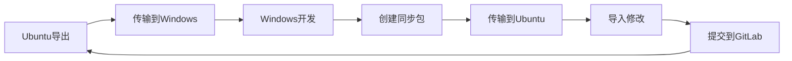

# Git 离线开发工具 - 简明操作指南

这套工具让您可以在Windows上离线开发Git仓库，然后同步回Ubuntu服务器。

## 🎯 使用场景

- **Windows电脑**：无法访问GitLab，需要离线开发
- **Ubuntu服务器**：有GitLab权限，可以导出和提交代码
- **目标**：两台电脑之间安全地同步代码修改

## 📋 快速开始

### 第一步：Ubuntu导出最新代码

在Ubuntu服务器上运行：
```bash
./export_bundles.sh
```

这会创建一个`bundles`目录，包含所有代码的离线包。

### 第二步：传输到Windows

将`bundles`目录复制到Windows电脑上。

### 第三步：Windows初始化

在Windows上首次使用时：
```powershell
.\Setup-OfflineRepo.ps1
```

这会创建离线工作环境。

### 第四步：Windows离线开发

正常进行代码修改：
```powershell
# 修改代码
git add .
git commit -m "我的修改"
```

### 第五步：创建同步包

开发完成后，创建同步包：
```powershell
.\Create-Bundle-From-Local.ps1
```

这会在`local-bundles`目录生成同步文件。

### 第六步：传输回Ubuntu

将`local-bundles`目录复制回Ubuntu服务器。

### 第七步：Ubuntu导入修改

在Ubuntu上导入Windows的修改：
```bash
./import_local_bundles.sh local_20250101_120000
```

### 第八步：提交到GitLab

检查并提交修改：
```bash
git status
git add .
git commit -m "从Windows同步的修改"
git push
```

## 🚀 一键式操作（推荐）

### Windows端：一键同步
```powershell
.\Auto-Sync-Workflow.ps1 -CreateLocalBundle
```

这个命令会：
1. 检查本地修改
2. 自动备份
3. 更新到最新代码
4. 创建同步包

### Ubuntu端：导入修改
```bash
./import_local_bundles.sh local_20250101_120000
```

## 📁 文件说明

| 文件 | 用途 | 使用场景 |
|------|------|----------|
| `export_bundles.sh` | Ubuntu导出代码 | 每次需要更新代码时 |
| `Setup-OfflineRepo.ps1` | Windows初始化 | 首次使用或重新设置 |
| `Auto-Sync-Workflow.ps1` | Windows一键同步 | 日常开发使用 |
| `Create-Bundle-From-Local.ps1` | 创建同步包 | 需要同步修改时 |
| `import_local_bundles.sh` | Ubuntu导入修改 | 接收Windows修改时 |

## ⚠️ 注意事项

### 安全提醒
- 重要修改前建议先备份
- 定期同步，避免积累太多修改
- 导入后要测试代码是否正常

### 常见问题
**Q: 同步时提示有冲突怎么办？**
A: 使用 `.\Interactive-Merge.ps1` 手动解决冲突

**Q: 忘记bundle前缀怎么办？**
A: 查看`local-bundles`目录中的文件名，前缀是`local_`开头的

**Q: 如何回滚到之前的版本？**
A: 使用备份目录或 `git reset --hard <commit-hash>`

## 🔄 完整工作流程示例



## 📞 需要帮助？

如果遇到问题：
1. 检查文件路径是否正确
2. 确保有足够的磁盘空间
3. 确认Git仓库状态正常
4. 查看错误信息中的具体提示

---

**提示**：建议先在小项目上测试这套工具，熟悉后再用于重要项目。 